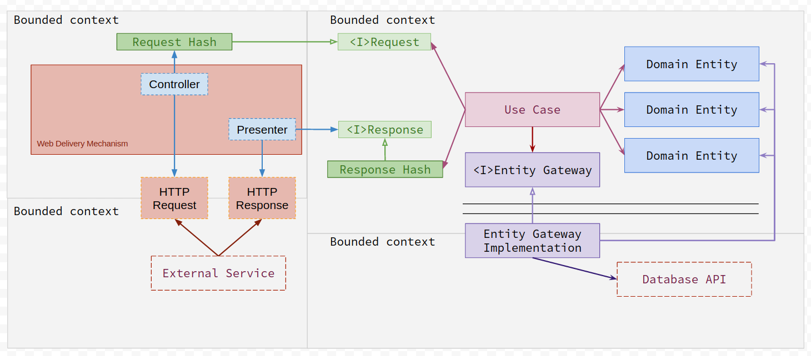

# Made Tech Flavour Clean Architecture: Ruby



## Testing 
* [RSpec](RSpec.md) (RSpec specific test layout)

## Production Code
``` (lib|src)/<insert customer name here>/**/*.rb```

Customer code should be housed within a Client namespace e.g. ```AcmeIndustries::Financial::UseCase::CreateInvoice```

Non-customer specfic code should be housed within a MadeTech namespace e.g. ```MadeTech::Authentication::UseCase::Login```

* [Use Cases](UseCases.md) use_case/ 
* [Domain](Domain.md) domain/
* [Gateway](Gateway.md) gateway/
